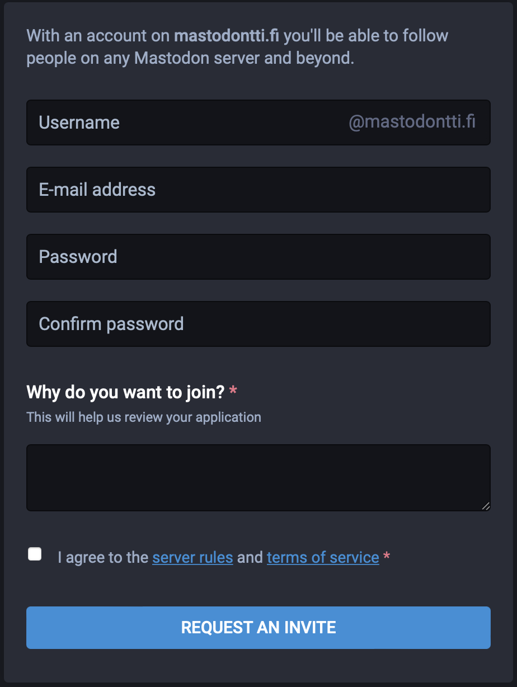
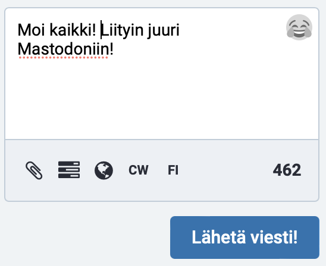

# Mastodon-opas

Tämä on pikaopas alkuun pääsemiseksi Mastodonin kanssa. Olen tarkoituksella jättänyt tästä pois filosofiset pohdiskelut eri järjestelmien luonteista ja myös suurimman osan Mastodonin ominaisuuksista pois ja yrittänyt keskittyä oleelliseen: mikä Mastodon on ja miten siihen voi liittyä.

## Mikä Mastodon?

Mastodon on samankaltainen somealusta kuin Twitter: sinne voi postittaa omia lyhyitä viestejä ja seurata muiden postauksia. Mastodon näyttää aika samanlaiselta kuin Twitter, ja sen käyttökin on pitkälti samanlaista. Mastodonia voi käyttää web-selaimella (toimii myös mobiililaitteissa) tai appia käyttämällä.

Mastodon-verkosto on pääosin harrastajien ja vapaaehtoisten ylläpitämä, ilman markkinointiosastoa tai ‑budjettia, ja välillä sen huomaa. Esimerkiksi siitä, että käyttöliittymät eivät aina ole ihan yhtä selkeitä ja loppuun hiottuja kuin kaupallisissa tuotteissa, tai että käytetty termistö voi olla vähän hassunkurista (Mastodonin vastine tviitille esimerkiksi on ”toot” eli tööttäys). Tähän kannattaa suhtautua ymmärtäväisesti.

### Miksi Mastodon?

Mastodon on ”vähän kuin Twitter, mutta parempi” (paremmuus on luonnollisesti makuasia). Sen hyviä puolia ovat muun muassa:

- Mikään yksittäinen taho ei omista sitä eikä voi määräillä käyttöä tai muutella tuosta vain ominaisuuksia.
- Ei rahanteko- tai koukutusalgoritmeja: keskiössä ovat käyttäjät ja se sisältö, jota jokainen on itse valinnut nähtäväkseen.
- Ei mainoksia.
- Ei someraivoon yllyttämistä keskeisenä osana alustan kulttuuria.

## Miten pääsen alkuun?

Ensimmäinen (ja isoin) kynnys Mastodonin käytön aloittamiseksi on serverin valinta. Mastodon on hajautettu järjestelmä, joka koostuu lukuisista eri servereistä (usein niitä kutsutaan myös instansseiksi). Mastodon-tunnus näyttää vähän sähköpostiosoitteelta, eli siinä on käyttäjätunnuksen perässä serverin osoite (esim. oma tunnukseni on [@t3ro@mastodon.social](https://mastodon.social/@t3ro)).

Servereitä on erilaisia, ja niillä voi olla keskenään vähän erilaisia sääntöjä esim. sallitun sisällön suhteen. ”Oman” serverin sisältöä on myös mahdollista selailla ja etsiä monipuolisemmin kuin koko verkostosta. Tästä ei kuitenkaan tarvitse tässä vaiheessa välittää.

Hyvä aloitusserveri suomalaisille, jotka aikovat viestiä Mastodonissa suomeksi, on [mastodontti.fi](https://mastodontti.fi/about). Mukaan voi liittyä kuka vain, mutta serverin erityissääntönä tosiaan on, että viestit lähetetään suomeksi.

Jos haluaa tööttäillä myös muilla kielillä, sopiva yleisserveri on esimerkiksi [mastodon.world](https://mastodon.world/about).

### Käyttäjätunnuksen rekisteröinti

Rekisteröinnin voi tehdä myös sovelluksesta, mutta helpointa se on web-liittymästä. Rekisteröitymislomake on yleensä heti serverin etusivulla.

Ennen tunnuksen rekisteröintiä kannattaa vilkaista serverin säännöt (esim. [mastodontti](https://mastodontti.fi/about/more)) läpi. Joudut joka tapauksessa hyväksymään ne, ja Mastodonissa ylläpitäjät yleensä valvovat sääntöjen noudattamista hiukan tarkemmin kuin isoissa megapalveluissa. Jos siis ko. serverin säännöissä on joku pykälä, joka ei tunnu sopivalta, kannattaa etsiä mieluummin toinen serveri kuin koettaa onneaan.

Valitse itsellesi käyttäjätunnus (sen pitää olla uniikki ko. serverillä, mutta muilla Mastodon-servereillä voi olla sama tunnus käytössä) ja salasana. Lisäksi tarvitset sähköpostiosoitteen, ja esim. Mastodontti pyytää lisäämään lyhyen syyn liittymiseen (näitä käytetään lähinnä spam-bottien yms. pitämiseksi pois). Useimmilla servereillä liittyminen ei vaadi tämän kummempaa. Nyt sinulla on Mastodon-tunnus!

## Okei, liityin mukaan. Mitä nyt?

Nyt voit lähettää maailmalle ensimmäisen tööttäyksesi! Kun olet kirjautunut Mastodoniin, serverin etusivulla on laatikko, johon voit kirjoittaa viestin ja klikata _Toot!_ (tai _Lähetä viesti_ tms.) Viestisi lähti maailmalle! (Tässä vaiheessa sitä ei luonnollisesti juuri kukaan näe, mutta asia korjautuu ajan myötä.)

### Omat tiedot

Jos haluat, että joku viitsii seurata sinua Mastodonissa, kannattaa seuraavaksi muokata asetuksista profiilitietojasi. Kirjoita lyhyt kuvaus, kerro vähän mikä sinua kiinnostaa, ja lisää nimi (tai nimimerkki) sekä profiilikuva (ei tarvitse pistää omaa pärstäänsä tähän välttämättä jos ei halua) – tämä kertoo, että olet todennäköisemmin oikea ihminen kuin satunnainen botti ja auttaa muita päättelemään, onko teillä jotain yhteistä.

### Seuraa muita

Jos tiedät jonkun sellaisen henkilön, jonka tööttäykset haluaisit nähdä, käyttäjätunnuksen, kirjoita se etusivun hakukenttään. Saat näkyviin henkilön tiedot ja voit seurata häntä – tämä tarkoittaa, että ko. henkilön postaukset näkyvät omassa viestivirrassasi.

### Siinä se

Onnittelut! Olet Mastodonissa!

## Mitä jos valitsin väärän serverin?

Serverin valinnan ei tarvitse olla valtavan iso päätös – jos myöhemmin huomaat, että joku toinen serveri sopisi sinulle paremmin, voit siirtää tunnuksen sinne ja säilyttää silti seuraajasi, jotka siirtyvät automaattisesti seuraamaan uutta tunnusta. (Lähettämäsi viestit eivät siirry automaattisesti, mutta niitäkin on mahdollista siirtää, se vain vaatii jonkin verran vaivannäköä.)

## Miten tästä eteenpäin?

Tulossa jatkoa Mastodonin käytöstä, mm.

- Miten löydän sisältöä?
- Hyvä tietää tööttäilystä
- Miten Twitter-kaverini löytävät minut?
